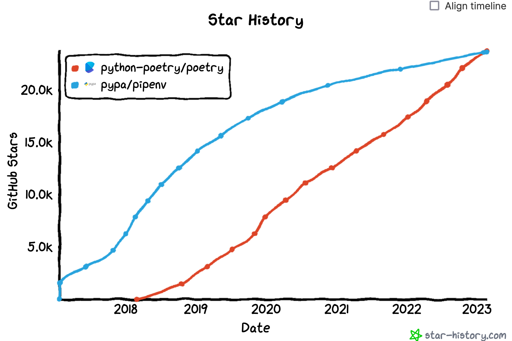

Python が好きではない。理由を挙げれば

- 実行速度の遅さ
- インデントによるコードブロックの表現
- スコープの概念の他の言語との差異（たとえばif文の中で定義した変数にif文の外からもアクセスできる）

などなどだが、これらは詳細に過ぎず、結局のところは僕と Python との個人的な相性な問題だと思う。みんなが好きだと言っているX君のことをなぜか私は好きになれない乙女心、といった具合だと思ってくれれば良い。

ところで、僕はこの3年間相当に応用的な分野で計算機科学と向き合ってきた。僕の分野では研究で用いる言語は Python が事実上の標準である。僕だけ Python 以外の言語を操るということももちろんできるが、共同研究者や研究を引き継いだ後輩に迷惑がかかるのも嫌だ。ということで、この3年間は好きではない Python と付き合わざるを得ない3年間であった。

好きではない言語でも3年間関わっていると多少は付き合い方も分かってくる。備忘録も兼ねて、僕が得た付き合い方の知見を共有する。


## Type-hint with Pylance(Pyright)
Python の弱点の一つは型システムがあまりにも弱いことである。僕は弱々プログラマなので、コード補完やエラー表示などエディタの支援機能が無いと生産性がガタ落ちする。型システムはエディタにこれらの機能をもたらすことができる。

[Python には 3.5 から Type-hint という機能が導入された](https://docs.python.org/ja/3/library/typing.html)。これを使うことで、簡易的ではあるが Python に型を導入することができる。

```python
def greeting(name: str) -> str:
    return 'Hello ' + name
```

このプログラムでは、 `greeting` の引数 `name` は str 型であり、返り値も str 型である。

型チェックには VS Code であれば [Pylance](https://github.com/microsoft/pylance-release) が、その他のエディタであれば [Pyright](https://github.com/microsoft/pyright) が便利である[^1]。VS Codeでは型チェックの厳密性を off, basic, strict の3種類から選択できる。特にこだわりがなければ basic にしておけば良い。


Python の Type-hint は意外に柔軟な型を表現できる。たとえば `typing.Literal` を使うと、TypeScript で言う string enum を表現できる[^2]。

```python
import typing

def get_professors(department: typing.Literal["coins", "mast", "kilis"]) -> list[str]:
    return []


get_professors("coins")
get_professors("mast")
get_professors("klis")

# これは許容値に含まれていないのでエラーになる
# get_professors("esys")
```

定数を定義できないという Python の弱点も、Type-hint である程度克服することができる。`typing.Final` を付けた変数は不変になる[^3]。

```python
import typing

# 固定のシード値
SEED: typing.Final = 3

# これは再代入なのでエラーになる
# SEED = 10
```

この他にも痒いところに手が届くユーティリティ型が一通り用意されているので、興味のある方は[公式ドキュメント](https://docs.python.org/ja/3/library/typing.html)に目を通すと良い。ただし Type-hint は比較的最近整備されだしたものなので、3.10 や 3.11 以降でしか使えない機能も多いので、その点は注意が必要である。

## dataclass
Python でデータの集合を表すときには次のようなパターンが考えられる。

- 辞書型
- リスト型
- タプル型
- 独自のクラス 

それぞれにメリット・デメリットがある。最も柔軟性が高く先述の型システムとの相性も良いのは独自のクラスを定義することであるが、コンストラクタ `__init__` の定義や、独自クラスから辞書型、タプル型への変換処理の実装など、冗長で面倒臭いことも多い。

データの集合を表す独自クラスを定義するときに便利なのが [dataclass](https://docs.python.org/ja/3/library/dataclasses.html) である。

```python
from dataclasses import dataclass

@dataclass
class User:
    name: str
    age: int
    admin: bool = False
```

Personクラスにはコンストラクタが定義されていないが、`@dataclass`アノテーションにより次のコンストラクタが暗黙的に追加される。

```python
    def __init__(self, name: str, age: int, admin: bool = False):
        self.name = name
        self.age = age
        self.admin = admin
```

さらに、REPL環境でクラスインスタンスを表示したときの表示のされかたを定義する `__repl__` メソッドも暗黙的に追加されるため、データの中身を容易に確認することができる。

```plain
$ python
>>> from example import User
>>> User("sudame", 25, True)
User(name='sudame', age=25, admin=True)
```

他にも、クラスインスタンスの同値性を確認する `__eq__` メソッドも暗黙的に追加される。またオプション次第では順序比較のための `__lt__` `__le__` を追加するようにすることも可能である。

便利な機能としては `frozen` オプションでクラスのプロパティへの再代入を禁止できたり、`kw_only` オプションでキーワード付き引数でのインスタンス化を強制できたりもする。

```python
from dataclasses import dataclass

@dataclass(frozen=True, kw_only=True)
class User:
    name: str
    age: int
    admin: bool = False


# キーワード無しでインスタンス化しようとしているのでエラー
# me = User("sudame", 25, True)

me = User(name="sudame", age=25, admin=True)

# フィールドに再代入しようとしているのでエラー
# me.name = "dame"
```

dataclass の嬉しいところはクラス定義の部分だけではない。たとえばdataclassで定義されたクラスは、`dataclasses.asdict` や `dataclasses.astuple` を用いることで辞書型やタプル型に変換することができる。学術研究においては実験の前処理などでデータ型の変換を散々行ったので、この機能は特に便利に使えた。

```python
from dataclasses import dataclass, asdict, astuple

@dataclass
class User:
    name: str
    age: int
    admin: bool = False

me = User("sudame", 25, True)

me_dict = asdict(me)
# > {'name': 'sudame', 'age': 25, 'admin': True}

me_tuple = astuple(me)
# > ('sudame', 25, True)
```

# Python as a Glue Language
> グルー言語 (英: glue language) とはプログラミング用語のひとつであり、ソフトウェアコンポーネント同士を結びつけることを主眼としたプログラミング言語の総称である。
> https://ja.wikipedia.org/wiki/%E3%82%B0%E3%83%AB%E3%83%BC%E8%A8%80%E8%AA%9E

Python をメインに使うからと言って、全てを Python で書く必要は無い。最終的な実験スクリプトは誰でも読んで実験の流れを理解し、再現実験ができるように Python で書くが、性能を求められる部分については他の言語で書き、 Python でそれらを呼び出すようにする。僕の場合は Julia や Rust を組み合わせて使っている[^4]。

[Julia はもともと Python を強く意識して作られている](https://docs.julialang.org/en/v1/manual/noteworthy-differences/#Noteworthy-differences-from-Python)。Python コミュニティを Julia 側にも取り込む思惑もあるのだろうが、[PyJulia](https://github.com/JuliaPy/pyjulia) というツールを使うと Julia の関数を極めて簡単に呼び出すことができる。

```python
import julia
julia.install()
from julia import Base
Base.sind(90) # 90-degreeのsinを求めるJulia関数を呼び出している
```

Rust にも [PyO3/maturin](https://github.com/PyO3/maturin) という有用なツールがあり、Rust のコードをほぼ変更することなく Python モジュールとして公開することができる。Rust の高速な動作や超強力な型システムの利益を享受しつつ実験全体のフローは Python で書くことができるのでとてもオススメな手法である。

## プロジェクト・パッケージ管理
Python のプロジェクト・パッケージ管理ツールは「[Python のパッケージ管理ツールは、長らく乱世にあると言える](https://vaaaaaanquish.hatenablog.com/entry/2021/03/29/221715)」とまで言われたりもするほど紆余曲折の最中にある。これも Python の大きな弱点だと思う（まぁたとえばJavaScriptも [npm](https://www.npmjs.com/) vs [yarn](https://yarnpkg.com/) vs [pnpm](https://pnpm.io/) vs ...みたいな状態なのでアレだが）。

個人的には、2023年現在は基本的に [Poetry](https://python-poetry.org/) を使うのが良いと思っている。Poetry が使用する設定ファイルである pyproject.toml は [PEP](https://peps.python.org/pep-0518/) で標準化されているし、[GitHubのスター数のから見ても](https://star-history.com/#python-poetry/poetry&pypa/pipenv&Date)現在勢いのあるツールは Poetry である [^5]。



Poetryの加点要素として、管理ファイルである pyproject.toml の仕様が現代的で良いという点がある。これについてはいくつか記事が出ているので参照してほしい[[参考1](https://qiita.com/ieiringoo/items/4bef4fc9975803b08671)][[参考2](https://data.gunosy.io/entry/linter_option_on_pyproject)]。

一方で最近は、単純な実験プロジェクトでは pipenv や Poetry などのツールは使わず、pip + virtualenv + requirements.txt で管理するのが良いのではないかと思いつつある。pip や virtualenv は Python さえインストールすれば自動で付いてくるので、実験をクラウド上のサーバーで行う場合などミニマムな環境で実験したい際に有利である。requirements.txt は最低限のバージョン管理しかできないが、実験では依存パッケージのバージョンをカッチリ固定することが求められるため、逆に便利だったりもする。

```sh
# 仮想環境の作成
python -m venv .venv

# 仮想環境のアクティベート
source .venv/bin/activate/

# 必要なパッケージのインストール
pip install -r requirements.txt
```

## Jupyter Notebook

Jupyter Notebook は使わないことにしている。たしかにテキストで書いたプログラムを部分的に逐次実行して結果をその場で得たいような場面は Python を書くに当たって多いが、その要求には Jupyter Notebook ではなく VS Code が答えてくれる。

Jupyter Notebook の難点は数多いが、たとえば Git 管理がしづらいことがある。Jupyter Notebook のノートブックファイル（.ipynbファイル）の中身は JSON ファイルである。この JSON ファイルはほんの少しの衝撃で一瞬で書き換わる。たとえば、プログラムを一切変更していなくても、あるセルをうっかり実行してしまうとファイルの内容が書き換わる。ノートブックを Git で管理できるようにするツールも[いくつか公開されている](https://codezine.jp/article/detail/16443)が、開発体験としては最悪である。

一方、VS Codeには Python ファイル（.py ファイル）の選択範囲を逐次実行する機能が搭載されている。これは単純な .py ファイルであるから、当然何も考えずに Git 管理することができる。また実験の一部をモジュール化する場合にも単純にファイルを切り分けるだけで良い。


[^1]: Python 謹製のツールを使いたいという場合は [mypy](https://github.com/python/mypy) という選択肢もある。
[^2]: Python 3.8 以上。
[^3]: Python 3.8 以上。
[^4]: 僕が研究している分野では for ループを高速に回したいという要求が強かったため、組み合わせる言語として Julia や Rust を選択した。システム系なら C/C++/Java、生物系なら R など何と組み合わせても良いと思う。
[^5]: 僕がプログラミングの際に使用するツールは、1.公式提供 2.みんなが使っている 3.自分に合っている の3点を、この順で優先して選択している。よってPythonのパッケージ管理ツールには本来PyPa公式の Pipenv を使いたいところではあるが、Pipenv の管理ファイルであある Pipfile はPEPで標準化されておらず、完全に独自フォーマットである。一方サードパーティ製の Poetry はPEPで標準化されている pyproject.toml を使っているため、1.公式提供 の項目では引き分けだ。そこで 2.みんなが使っている の項目に進むが、これもGitHub Starのグラフの通り2023年時点では引き分けだが、勢いを見ると Poetry の方が優勢である。このような事情で Poetry を選択している。
